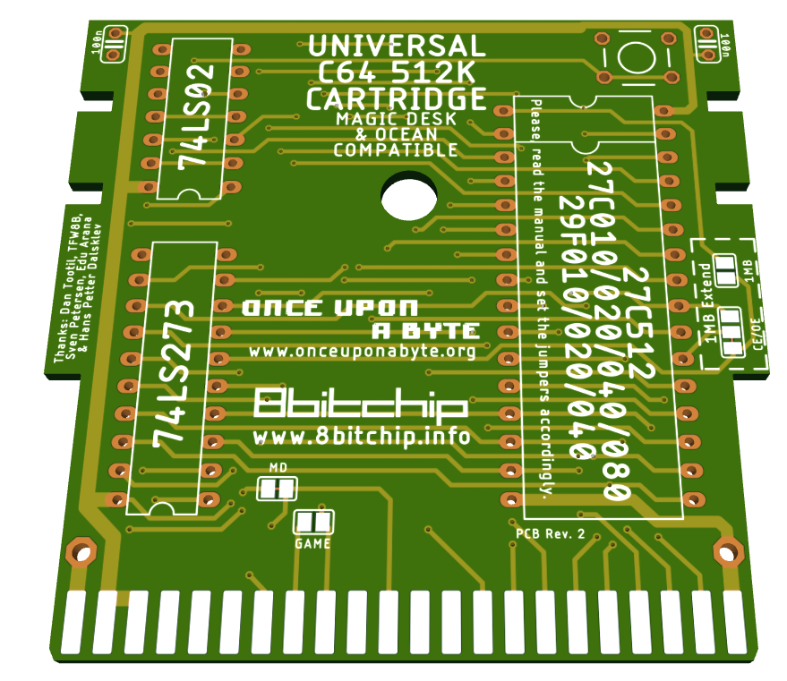
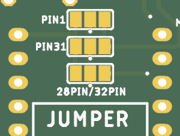
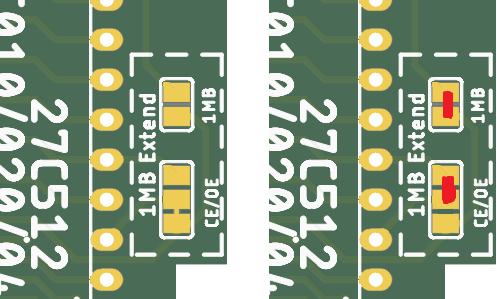

# c64-uni-cart
Hardware design of Magic Desk and Ocean compatible cartridge for the Commodore 64

This is the hardware part that accompanies the project of [Magic Desk Cartridge Generator](https://bitbucket.org/zzarko/magic-desk-cartridge-generator/)

This project is free and you can use any PCB manufacturer by downloading the Gerber files, but if you would like to support my work and help with further C64 hardware development you can order these PCBs on PCBWay trough this link:

[](https://www.pcbway.com/project/shareproject/updatethislink.html)

You will get cheap and professionally made PCBs, I will get credits that will help with this and [other projects](https://www.pcbway.com/project/member/?bmbno=1DE407A1-1650-47).

Also, if you have to register to that site, [you can use this link](https://www.pcbway.com/setinvite.aspx?inviteid=296307) to get some bonus initial credit (and yield me some more).



Hardware Description
--------------------

Magic Desk cartridges, in their original form, could hold up to 128Kb of code, or up to 16 banks of 8Kb each. Bank selection is done by writing to $DE00. If bit 8 is set, then EXROM is disabled and RAM in the range of $8000 - $9FFF is usable.

This cartridge expands on the idea by having 128 banks of 8Kb available, thus the maximum size is 1 Mb.

Inputs of an 8-bit latch (74LS273) are connected to the data lines. Correct decoding for the I/O1 signal is done by combining PHI2 and I/O1 trough the NOR gates of 74LS02. The only feature that is deviant from the original Magic Desk specification, is that when you disable the cartridge by writing a value of $80 or larger to $DE00, the banking mechanism gets locked and no more write attempts to $DE00 will change the register's state until a hardware reset is performed. This had to be done because some programs would unintentionally write to $DE00 (or any other location in the I/O1 range) and sometimes, if $01 is wrongly set by the program, it could result in a crash. Since the use of this particular cartrige is primarily to enable making onefile program compilations, we have decided to do it this way. If you want (or need) full compatibility with the original Magic Desk cartridge hardware, we have left a jumper to disable this behaviour. Cut the track exposed on the LOCK jumper ("YES" position) on the bottom side of the cartridge PCB, and connect it to the "NO" position. This way the locking mechanism is disabled, but still you can remove the cartridge from the memory map by setting the bit 7 of the latch high.

The PCB was designed to accomodate various types of EPROMs and their FLASH variants. The smallest EPROM you can use is 27C512 (64Kb), and the largest is 27C040 (512 Kb). There is an option to expand the board to a full 1Mb, which will be explained below.

Jumper configuration
--------------------

In order to support most common types of EPROMs and FLASH EPROMs, a bank of solder jumpers had to be placed on the bottom side of the PCB. They look like this:



These jumpers HAVE to be configured before plugging the cartridge to your C64! Different types of EPROMs and their FLASH variants have some pins swapped, and if you are using a chip smaller than the maximum size, the unused adress lines have to be pulled high on the EPROM side to ensure proper functioning. Also, 27C512 is "shorter" by 4 pins, so it's power supply pin must be connected to +5V instead of being allocated as A17 on the larger ones. The leftmost pins of all 4 jumpers are +5V, and the rightmost pins are the address lines. The middle pin of the jumpers are connected according to the table:

|    Jumper   | Pin | Description                                 |
|-------------|-----|---------------------------------------------|
| PIN1        | 1   | routes either A18 or VCC to pin 1 of EPROM  |
| PIN31       | 31  | routes either A18 or VCC to pin 31 of EPROM |
| 28PIN/32PIN | 30  | routes either A17 or VCC to pin 30 of EPROM |

Here is the table for configuring the jumpers on most common variants of EPROMS and their FLASH counterparts.

| Jumper      | 27C512  | 27C010  | 29F010  | 27C020  | 29F020  | 27C040  | 29F040  |
|-------------|---------|---------|---------|---------|---------|---------|---------|
| PIN1        | ```[X X X]``` | ```[X=X X]``` | ```[X=X X]``` | ```[X=X X]``` | ```[X=X X]``` | ```[X=X X]``` | ```[X X=X]``` |
| PIN31       | ```[X X X]``` | ```[X=X X]``` | ```[X=X X]``` | ```[X=X X]``` | ```[X=X X]``` | ```[X X=X]``` | ```[X=X X]``` |
| 28PIN/32PIN | ```[X=X X]``` | ```[X X=X]``` | ```[X X=X]``` | ```[X X=X]``` | ```[X X=X]``` | ```[X X=X]``` | ```[X X=X]``` |

Precautions have been taken to ensure the corectness of the table above. Please, check the datasheet of your particular (FLASH) EPROM and configure the jumpers accordingly.

Beyond 512Kb
------------

Full 1Mb is achievable using a 27C080 or 27C801 EPROM. Other types of memory are not supported. On the right top side of the PCB there are two jumpers marked as "1MB Extend". You should leave out connections on the jumper PIN1 on the bottom side, move the jumper from CE to OE and connect the 1MB jumper, as seen in the pictures. Note that this breaks Ocean compatibility.



RESET button
------------

The pads for the RESET button will accomodate a vertical miniature tact switch.

Capacitors
----------

The capacitors are not needed, but you can populate them. They are 100nF 50V MLCC capacitors with 2.54mm raster.

Enclosure compatibility
-----------------------

The PCB is designed so it can be used in various types of cartridge cases. It has been mainly designed to fit the "Stumpy" cartridge from TFW8B, but it also fits the original Commodore cases and cases from the Polish companies KRADEX / MASZCZYK which are available at some retailers in Europe. It also fits in a 3D-printed case from the model available at Thingiverse. Unfortunately, I don't have all of the cartridge cases available in the market, so the design is NOT tested to fit with: Individual Computers' and Shareware Plus' (and all other currently available but not mentioned here) cases. If anyone wants to donate these types of cartridge cases, adjustments to the PCB could be made and a "one board fits all" PCB could be produced.
Please note - the cartridge cases from KRADEX / MASZCZYK are "low profile", and you cannot use a socket for the EPROM with this type of cases!

### License
c64-uni-cart is Open Hardware licensed under the [CERN OHL v. 1.2](http://ohwr.org/cernohl), released by Marko Šolajić in 2020. You may redistribute and modify this documentation under the terms of the CERN OHL v.1.2.

A copy of the full license is included in file [LICENSE.txt](LICENSE.txt)
