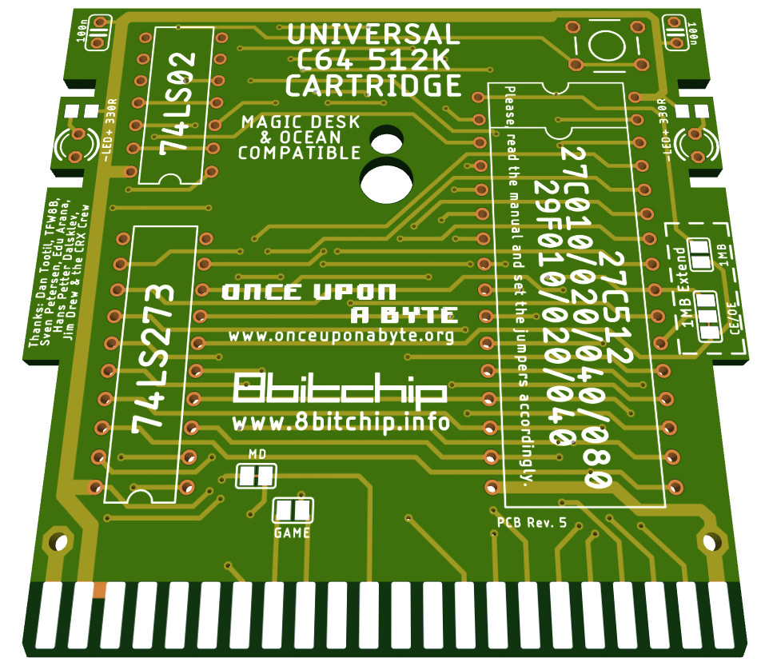
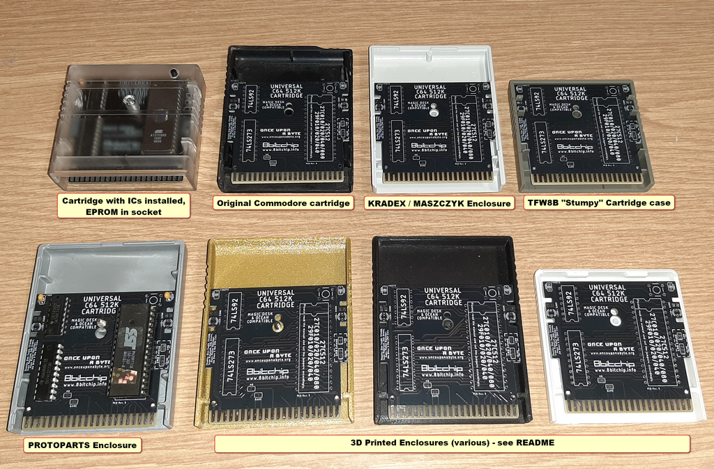
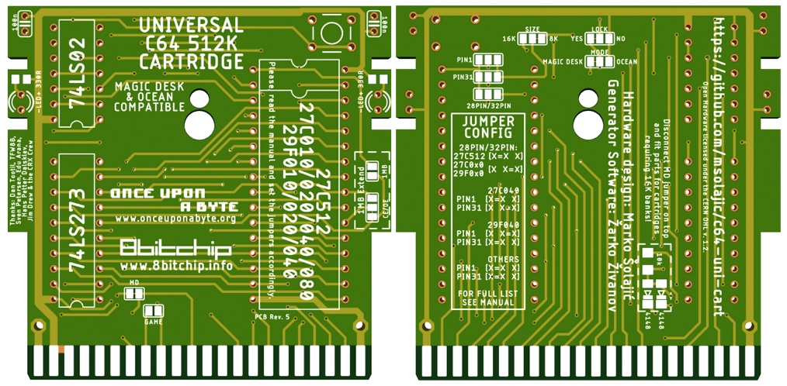

# c64-uni-cart
Hardware design of Magic Desk and Ocean compatible cartridge for the Commodore 64

This is the hardware part that accompanies the project of [Magic Desk Cartridge Generator](https://bitbucket.org/zzarko/magic-desk-cartridge-generator/)

This project is free to use and you can use any PCB manufacturer by downloading the Gerber files, but if you would like to support my work and help with further C64 hardware development you can order these PCBs on PCBWay trough this link:

[](https://www.pcbway.com/project/shareproject/Universal_C64_1MB_cartridge.html)

You will get cheap and professionally made PCBs, I will get credits that will help with this and [other projects](https://www.pcbway.com/project/member/?bmbno=1DE407A1-1650-47). Also, if you have to register to that site, [you can use this link](https://www.pcbway.com/setinvite.aspx?inviteid=296307) to get bonus initial credit.



Hardware Description
--------------------

Magic Desk cartridges, in their original form, could hold up to 128Kb of code, or up to 16 banks of 8Kb each. Bank selection is done by writing a byte to $DE00. If bit 8 is set, then EXROM is disabled and RAM in the range of $8000 - $9FFF is usable.

This cartridge expands on the idea by having 128 banks of 8Kb available, thus the maximum size is 1 Mb.

Inputs of an 8-bit latch (74LS273) are connected to the data lines. Correct decoding for the I/O1 signal is done by combining PHI2 and I/O1 trough the NOR gates of 74LS02. The only feature that is deviant from the original Magic Desk specification, is that when you disable the cartridge by writing a value of $80 or larger to $DE00, the banking mechanism gets locked and no more write attempts to $DE00 will change the register's state until a hardware reset is performed. This had to be done because some programs would unintentionally write to $DE00 (or any other location in the I/O1 range) and sometimes, if $01 is wrongly set by the program, it could result in a crash. Since the use of this particular cartrige is primarily to enable making onefile program compilations trough the [Magic Desk Cartridge Generator](https://bitbucket.org/zzarko/magic-desk-cartridge-generator/), we have decided to do it this way. If you want (or need) full compatibility with the original Magic Desk cartridge hardware, we have left a jumper to disable this behaviour. Cut the track exposed on the LOCK jumper ("YES" position) on the bottom side of the cartridge PCB, and connect it to the "NO" position. This way the locking mechanism is disabled, but still you can remove the cartridge from the memory map by setting the bit 7 of the latch high.

The PCB was designed to accomodate various types of EPROMs and their FLASH variants. The smallest EPROM you can use is 27C512 (64Kb), and the largest is 27C040 (512 Kb). There is an option to expand the board to a full 1Mb, which will be explained below.

Jumper configuration
--------------------

Do not be intimidated with the amount of jumpers on the board. They are preconfigured for Magic Desk cartridges. I you need Ocean (and other types of cartridges) compatibility, please continue reading, it is described further below. First, you need to configure the memory selection jumpers.

In order to support most common types of EPROMs and FLASH EPROMs, a bank of solder jumpers had to be placed on the bottom side of the PCB. They look like this:


These jumpers HAVE to be configured before plugging the cartridge to your C64! Different types of EPROMs and their FLASH variants have some pins swapped, and if you are using a chip smaller than the maximum size, the unused address lines have to be pulled high on the EPROM side to ensure proper functioning. Also, 27C512 is "shorter" by 4 pins, so it's power supply pin must be connected to +5V instead of being allocated as A17 on the larger ones. The leftmost pins of all 3 jumpers are +5V, and the rightmost pins are the address lines. The middle pins of the jumpers are connected according to the table:

|    Jumper   | Pin | Description                                 |
|-------------|-----|---------------------------------------------|
| PIN1        | 1   | routes either A18 or VCC to pin 1 of EPROM  |
| PIN31       | 31  | routes either A18 or VCC to pin 31 of EPROM |
| 28PIN/32PIN | 30  | routes either A17 or VCC to pin 30 of EPROM |

Here is the table for configuring the jumpers on most common variants of EPROMS and their FLASH counterparts.

| Jumper      |    27C512     |    27C010     |    29F010     |    27C020     |    29F020     |    27C040     |    29F040     |
|-------------|---------------|---------------|---------------|---------------|---------------|---------------|---------------|
| PIN1        | ```[X X X]``` | ```[X=X X]``` | ```[X=X X]``` | ```[X=X X]``` | ```[X=X X]``` | ```[X=X X]``` | ```[X X=X]``` |
| PIN31       | ```[X X X]``` | ```[X=X X]``` | ```[X=X X]``` | ```[X=X X]``` | ```[X=X X]``` | ```[X X=X]``` | ```[X=X X]``` |
| 28PIN/32PIN | ```[X=X X]``` | ```[X X=X]``` | ```[X X=X]``` | ```[X X=X]``` | ```[X X=X]``` | ```[X X=X]``` | ```[X X=X]``` |

Precautions have been taken to ensure the corectness of the table above. Please, check the datasheet of your particular (FLASH) EPROM and configure the jumpers accordingly.

Beyond 512Kb
------------

Full 1Mb is achievable using a 27C080 or 27C801 EPROM. Other types of memory are not supported. On the right top side of the PCB there are two jumpers marked as "1MB Extend". You should **leave out connections on the jumper PIN1 on the bottom side and configure other jumpers as for 27C040**, move the jumper in the "1MB Extend" block from CE to OE and connect the 1MB jumper, as seen in the pictures. Note that this breaks Ocean compatibility.


Advanced Jumper Configuration
-----------------------------

The board has 5 jumpers that are associated with the change of functions from Magic Desk to Ocean (and others). Ocean cartridges are differently mapped in memory, depending on their size. 128k and 512k games use plain 8k /EXROM mapping, but 256k games need to see two different banks in the 16k window.

**MODE** - Completely disable or enable usage of the bit 7 of latch, so Ocean images can work.
- When in position **OCEAN** - bit 7 is disabled, in **MAGIC DESK** - Enabled. 
- Default is **MAGIC DESK**

**LOCK** - Enable or disable latch locking when the latch bit 7 is set (for Ocean, EasyFlash conversions and C64GS). 
- Position **YES** - Enabled, **NO** - Disabled. 
- Default is **YES**. 
- This jumper has no effect if **MODE** is set to **OCEAN** position.
- The effect of this jumper is that you can remove the cartridge temporarily from the memory map by setting bit 7 high, but if needed, it can be re-enabled. 

**GAME** - Enable 16K mapping by pulling /GAME low together with /EXROM ($8000-$9FFF & $A000-$BFFF)
- This is used for EasyFlash conversions and Ocean carts that require two 8k banks. 
- Depending on **SIZE**, this will either show the same 8K bank mirrored in both windows (if **SIZE** is in 8k position) or two different 8k banks (if **SIZE** is set to 16k)

**SIZE** - Map C64 A13 to A18 of the EPROM (for 16K configurations). 
- To be used in conjuction with **GAME** and **MD** jumper.
- If **GAME** jumper is set, and **SIZE** is left at 8k position, both 8k windows show the same data. 
- If **SIZE** is in 16k position, two 8k windows show different data. 

**MD** - If no 16k configuration is needed, leave closed and don't install diodes and resistor on the bottom. If any 16K configuration is needed, cut and install 2x1N4148 diodes and 10k resistor.
- This connects both /ROML and /ROMH to /OE of the EPROM.

Examples for configuring jumpers
--------------------------------

### Ocean 128k
(Batman The Movie, Double Dragon, Navy Seals, Pang etc.)
- Use a 128k EPROM or FLASH, set the memory type selection jumpers accordingly. 
- Set **MODE** jumper to OCEAN.

### Ocean 256K
(Shadow of the Beast, Robocop 2, Chase HQ 2)
- Use a 512k EPROM or FLASH. You need to program the same image in both 256k halves of the EPROM. Set memory type selection jumpers accordingly.
- Use the following jumper settings: **MODE** Ocean, **LOCK** No, **SIZE** 16k, **GAME** connected, **MD** disconnected, resistor and diodes installed.

### Ocean 512k
(Terminator 2)
- Use a 512k EPROM or FLASH, set the memory type selection jumpers accordingly.
- Move **MODE** from MAGIC DESK to OCEAN.

### C64GS / System 3
- Myth and Last Ninja work with the following configuration:
- **MODE** Magic, **LOCK** No, **SIZE** 8k, **GAME** disconnected, **MD** connected, resistor and diodes **NOT** installed.
- Myth reqires you to type **SYS 3 MYTH** on the black screen to start the game.
- C64GS cartridge doesn't work - it writes wrong banks as it uses STA $DE00,X. This would need to be changed to STX $DE00, and one STA $DE00 needs to be changed to LDA #$00, STA $DE00. I'm investigating the possible patch.
- Probably the former is also valid for the recently leaked Elite .crt files. I haven't investigated them yet.

### EasyFlash conversions
Some of EasyFlash games can be converted to use this cartridge. Usually, if the game doesn't use eAPI or is not converted with disk2easyflash, then it can be converted. The startup code (because Easyflash starts in ULTIMAX mode which cannot be emulated here) needs also to be moved, if needed. Here are some games that I successfully converted to use this cartridge:
- [Mayhem in Monsterland](https://csdb.dk/release/?id=127251)
    - Requres a 512Kb chip
    - Export the .crt file using [crt2chip2](https://csdb.dk/release/?id=187607)
    - Using a hex editor, take the first 256Kb of both U4 and U3 files, and concatenate them to one file (First the data from U4, then from U3)
    - Find all banking routines and patch them to use $0x instead of $4x.
    - Patch out any $DE02 access by NOP
    - Use the following jumper settings: **MODE** Magic, **LOCK** No, **SIZE** 16k, **GAME** connected, **MD** disconnected, resistor and diodes installed.
    - Patch file for use with bspatch ([Windows](https://www.pokorra.de/coding/bsdiff.html) / [Linux](http://www.daemonology.net/bsdiff/)) available [HERE](./patch/MayhemInMonsterland.diff)

- [Creatures 2](https://csdb.dk/release/?id=129448)
    - Requres a 512Kb chip
    - Export the .crt file using [crt2chip2](https://csdb.dk/release/?id=187607)
    - Only the U4 file is needed.
    - Minimal startup code and vector initialization needs to be added to the first bank of the cartridge file ($0000 - $2000), part of the code is in U3 file. There is some empty space at $1FE0, use it wisely...
    - CBM80 signature needs to be altered to point to the newly added startup code
    - Use the following jumper settings: **MODE** Magic, **LOCK** No, **SIZE** 8k, **GAME** disconnected, **MD** connected, resistor and diodes **NOT** installed.
    - Patch file for use with bspatch ([Windows](https://www.pokorra.de/coding/bsdiff.html) / [Linux](http://www.daemonology.net/bsdiff/)) available [HERE](./patch/Creatures2.diff)
    
- [Prince of Persia](https://csdb.dk/release/?id=102540)
    - Requres a 512Kb chip
    - Export the .crt file using [crt2chip2](https://csdb.dk/release/?id=187607)
    - Using a hex editor, load the resulting U4 file at offset $00000 and U3 file at offset $40000, and save them as one file.
    - Startup code and vector initialization needs to be patched, as it will be available at $A000 and not at $E000. 
    - CBM80 signature needs to be added to point to the startup code. The BASIC SYS command is at offset $00000, you can patch it out as it turns out it is not used.
    - Use the following jumper settings: **MODE** Magic, **LOCK** No, **SIZE** 16k, **GAME** connected, **MD** disconnected, resistor and diodes installed.
    - Patch file for use with bspatch ([Windows](https://www.pokorra.de/coding/bsdiff.html) / [Linux](http://www.daemonology.net/bsdiff/)) available [HERE](./patch/pop.diff)
    - **NOTE**: The game is not play-tested, as I suck in playing it. Feedback is appreciated. Also, probably the save function (available after level 4) will not work and will crash the machine.
    
As I patch more games, I'll describe the process here. Useful tools for patching are [C64Debugger](https://csdb.dk/release/?id=187948) and [Regenerator](https://csdb.dk/release/?id=149429).

RESET button
------------

The pads for the RESET button will accomodate a vertical miniature tact switch. 

Capacitors
----------

The capacitors are not needed, but you can populate them. They are 100nF 50V MLCC capacitors with 2.54mm raster.

Enclosure compatibility
-----------------------

The PCB is designed so it can be used in various types of cartridge cases. It has been mainly designed to fit the "Stumpy" cartridge from [TFW8B](https://www.thefuturewas8bit.com/c64romcart.html), but it also fits the original Commodore cases and cases from the Polish companies KRADEX / MASZCZYK which are available at some retailers in Europe. It also fits in several 3D-printed cases available at Thingiverse, and there is also one tailor-made for this cartridge, [case for universal C64 512K cartridge by Vokgear](https://www.thingiverse.com/thing:4801176). In revision 5, a hole has been added to support use of [Protoparts] (https://www.protoparts.at/product-category/gehaeuse/) enclosures. Unfortunately, I don't have all of the cartridge cases available in the market, so the design is NOT tested to fit with: Individual Computers' and Shareware Plus' (and all other currently available but not mentioned here) cases. 

Please note - the cartridge cases from KRADEX / MASZCZYK are "low profile", and you cannot use a socket for the EPROM with this type of cases!



Also, recently TFW8B came out with their [MARINA 64 cartridge](https://www.thefuturewas8bit.com/shop/commodore/c64/marina64.html). This was not made to compete with their design - actually, development was done concurrently, not knowing what the other party was doing. 

But, where are the EAGLE schematic and PCB design? (Updated!)
-------------------------------------------------------------

~~Glad that you asked. The schematic is available as a .pdf file, and for the time being I'm making only the Gerbers available, because of people taking credit for my designs, removing texts and presenting the cartridges as their own product, thus breaching the license, and later refusing to take action upon notice. I hope that you can understand. You can see from the photos, this was not an easy task to route. If you have good intentions, I will provide you the files via e-mail or other communications channel. The EAGLE files will be made available 6 months from the date of the release (on 1st of October 2020.)~~

EAGLE .sch and .brd files are now available to download in this repository. Please, respect the license when downloading the files.



Revision history
----------------

- Rev.1
    - Initial release, not public
- Rev.2
    - Clearance issue with the diodes and GAME jumper addressed
    - Added 1MB Extension jumpers
    - Enlarged all jumpers
    - Cosmetic improvements
- Rev.3
    - Internal revision, not public
- Rev.4
    - Added place for (optional) 2 LEDs and 2 resistors, for that special bling if you have a transparent case. For best results, use colour changing 3mm LEDs.
    - Table with jumpers on the bottom side is now more legible
    - Added a solder mask stop on the edge connector
- Rev.5
    - Added a smaller hole above the existing one, to enable use of [Protoparts](https://www.protoparts.at/product-category/gehaeuse/) enclosures. Probably now also fits [Individual Computers](http://wiki.icomp.de/wiki/C64_Cartridge_Cases) cases.
    
Thanks:
-------

My thanks go to:

- Žarko Živanov, for creating the Magic Desk Cartridge Generator
- Dan Tootil, for his questions and suggestions that lead to this version of the Cartridge
- TFW8B, for creating such an awesome cartridge case
- Sven Petersen, Edu Arana & Hans Petter Dalsklev, for their knowledge and hardware they are sharing with the community
- Jim Drew, for acknowledging and making this the official CRX2020 Hardware project
- Everyone who ordered any of my PCBs from PCBWay
- and all other people in the Commodore 64 community that I forgot to mention, you guys are awesome!

License
-------
c64-uni-cart is Open Hardware licensed under the [CERN OHL v. 1.2](http://ohwr.org/cernohl), released by Marko Šolajić in 2020. You may redistribute and modify this documentation under the terms of the CERN OHL v.1.2.

A copy of the full license is included in file [LICENSE.txt](LICENSE.txt)
